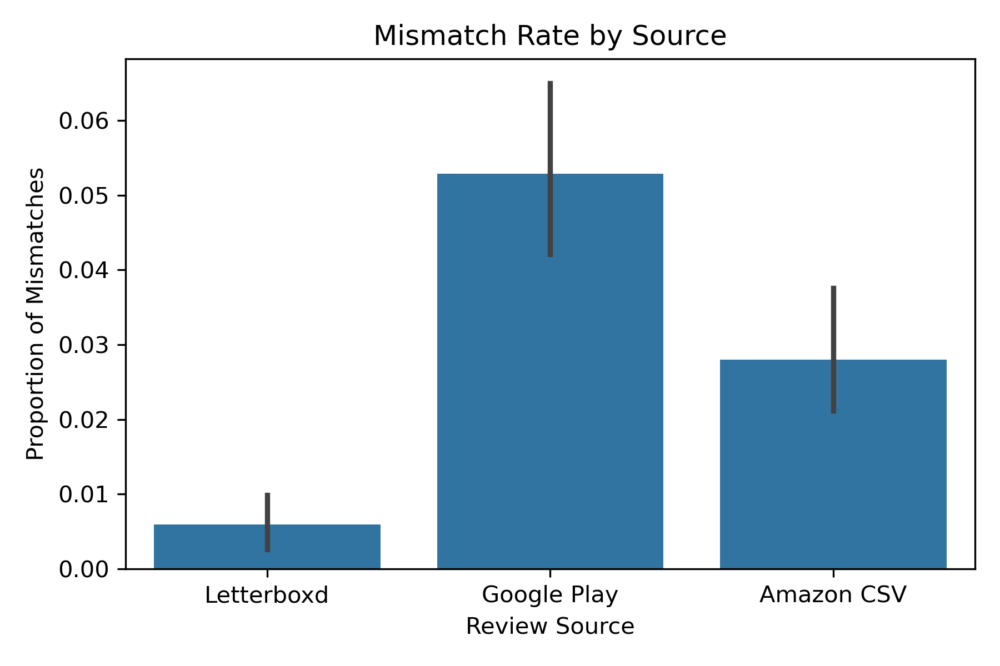
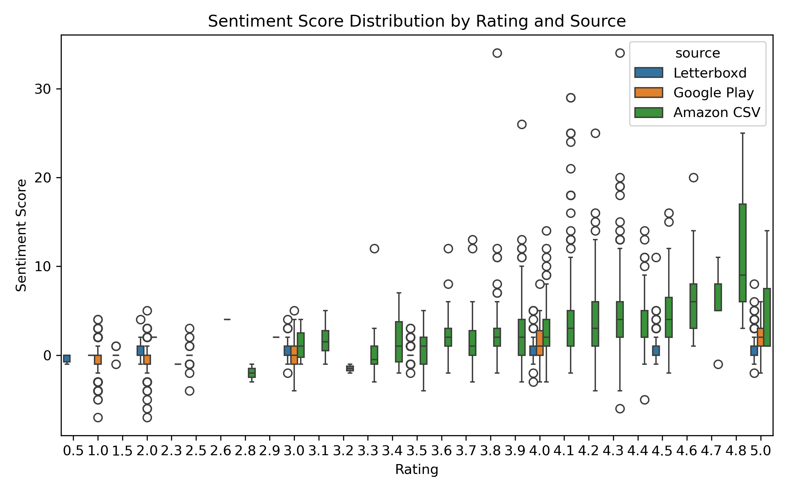
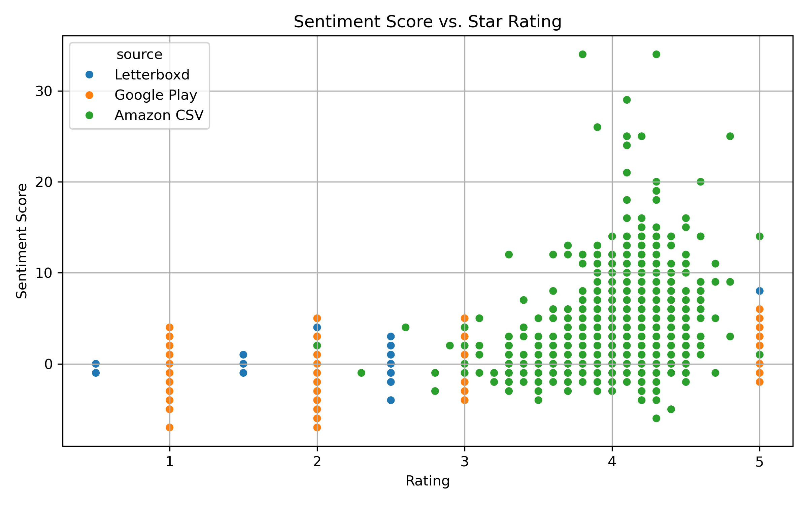
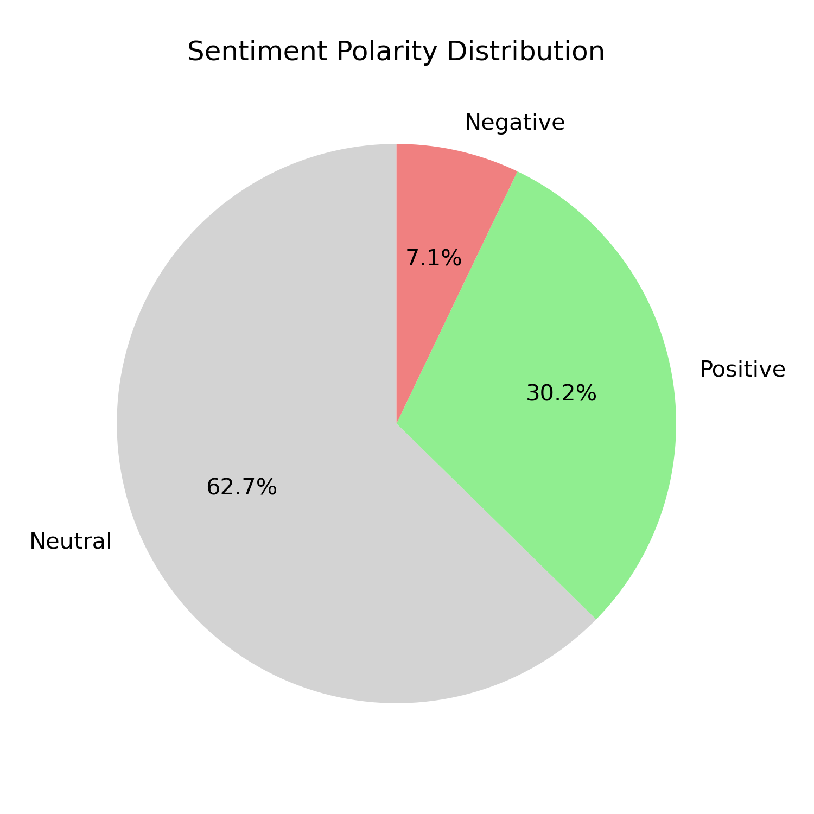
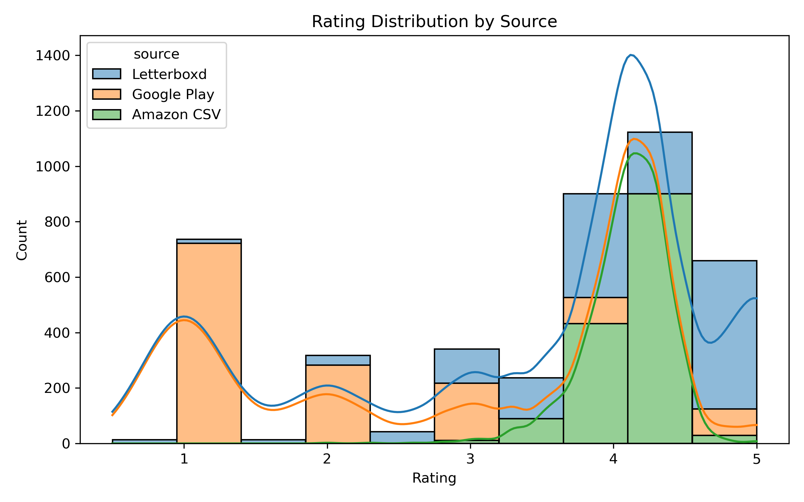

# Sentiment vs. Star Ratings: Multi-Platform Review Analysis

This project analyzes how sentiment extracted from user review text aligns (or misaligns) with star ratings across three major platforms: Letterboxd (movies), Google Play (apps), and Amazon (products). The analysis combines scraping, API usage, CSV ingestion, and statistical testing to uncover platform-specific behaviors in user reviews.

**Author**: Wil Sheffield  
**Date**: May 2025

---

## Objectives

- Measure alignment between review sentiment and star rating
- Quantify mismatches where sentiment contradicts rating
- Compare mismatch behavior across platforms
- Apply statistical testing to validate significance

---

## Repository Structure
.
├── data/                      # Raw + combined review datasets
│   ├── app_reviews.csv
│   ├── combined_reviews.csv
│   ├── movie_reviews.csv
│   └── product_reviews.csv
├── visualizations/           # Final project visuals (PNG)
│   ├── mismatch_by_source.png
│   ├── polarity_by_rating_boxplot.png
│   ├── rating_distribution_by_source.png
│   ├── sentiment_polarity_distribution.png
│   └── sentiment_vs_rating.png
├── 01_final_notebook.ipynb               # Jupyter Notebook with full code
├── 02_final_report.pdf             # Written report (PDF)
└── README.md                    # Project overview (this file)

---

## Methodology

### Data Sources
| Platform      | Source Type  | Volume    | Notes                              |
|---------------|--------------|-----------|------------------------------------|
| Letterboxd    | Web Scraping | ~1,500    | Movie reviews                      |
| Google Play   | API (RapidAPI) | ~1,400  | App reviews for 7 apps             |
| Amazon        | CSV (Kaggle) | ~1,500    | Product reviews                    |

### Process
1. **Scraping & API Integration**: Retrieved review text and metadata from 3 sources  
2. **Data Normalization**: Unified rating scales and formats across platforms  
3. **Keyword-Based Sentiment Scoring**: Assigned polarity scores using curated word lists  
4. **Mismatch Classification**: Flagged cases where sentiment and rating diverged  
5. **Statistical Testing**: Applied chi-square, ANOVA, and t-tests to assess platform differences

---

## Key Visualizations

### Mismatch Rate by Platform  

### Sentiment Score Distribution by Rating  

### Sentiment vs. Star Rating Scatter  

### Sentiment Polarity Breakdown  

### Rating Distribution by Platform  

---

## Key Findings

- **Google Play** had the highest mismatch rate (~5.3%), suggesting possible rating inflation  
- **Letterboxd** showed the lowest mismatch rate, with strong sentiment-rating alignment  
- **Amazon** fell in between, with inconsistencies often tied to ambiguous text  
- **Statistical analysis confirmed** that platform differences in mismatch rates are significant (p < 0.01)  
- Mismatched reviews often had **extreme sentiment scores**, even when assigned 1 or 5 stars

---

## File Descriptions

| File | Description |
|------|-------------|
| `01_final_notebook.ipynb` | Full analysis notebook with code, charts, and explanation |
| `02_final_report.pdf` | Formal write-up of the project and findings |
| `data/*.csv` | All review data: movie, app, product, combined |
| `visualizations/*.png` | All generated visualizations used in the report |
| `README.md` | This markdown summary |

---

## Tools & Technologies

- **Python** (Pandas, Seaborn, Matplotlib, NumPy, SciPy)  
- **BeautifulSoup** for scraping Letterboxd  
- **RapidAPI** for Google Play app reviews  
- **Jupyter Notebook** for analysis  
- **Markdown** for documentation  

---

## Future Improvements

- Integrate **ML-based sentiment models** (e.g. VADER, TextBlob, BERT)  
- Handle **negation, sarcasm**, and **contextual nuance** in sentiment  
- Expand to more platforms (e.g. Yelp, Steam, Goodreads)  
- Visualize **user-level behavior** and reviewer bias
